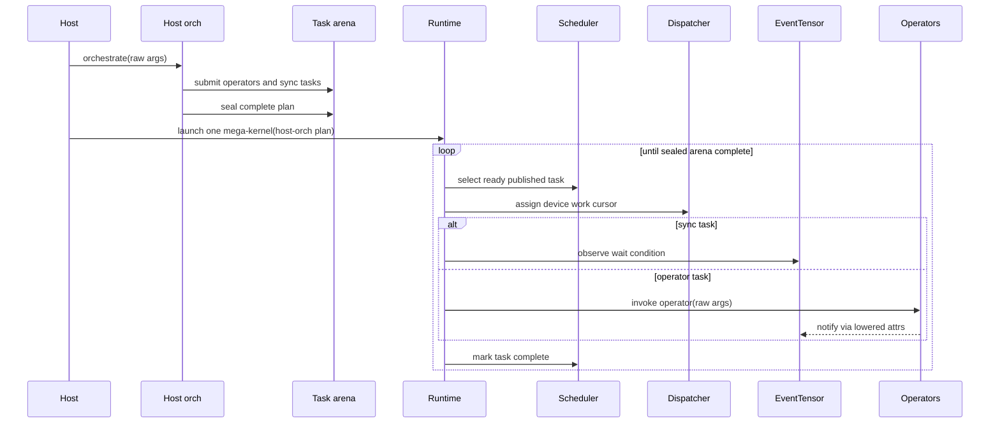
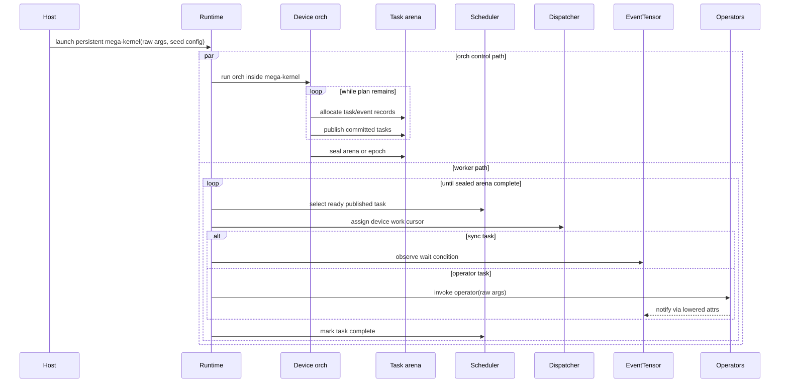
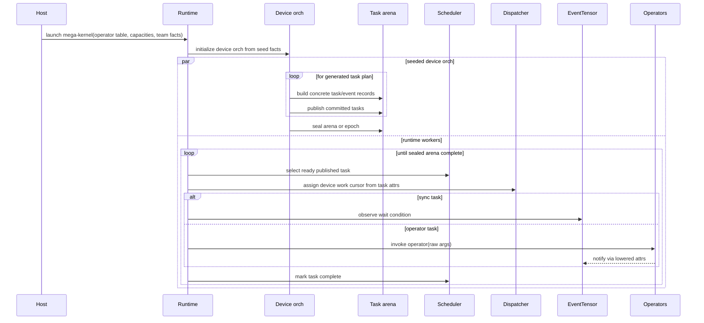
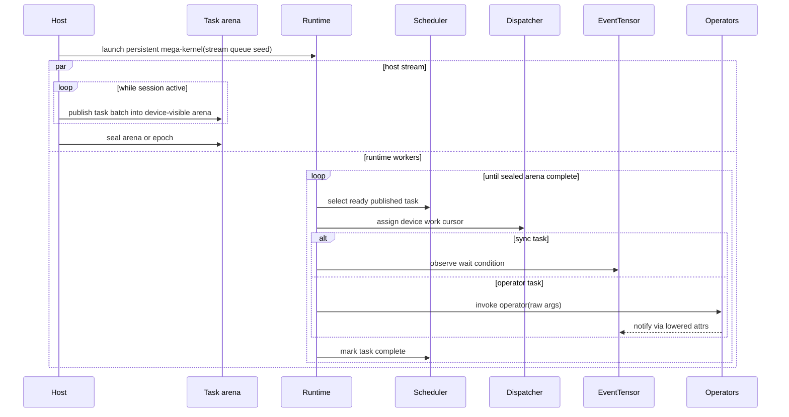
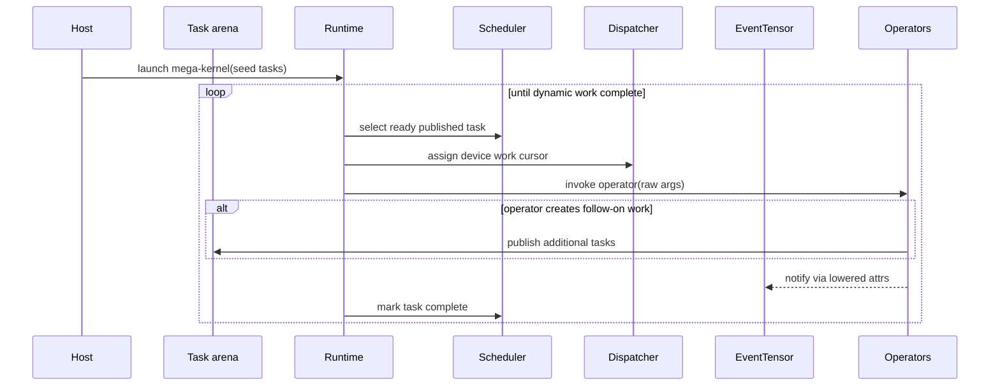

# Execution Model Study

Status: active design study for the general runtime-linked components PR.
Promote accepted conclusions into stable `docs/design/` only during PR
closeout.

## Goal

Megacu needs an explicit runtime execution-model architecture, not an
accidental host-finalize path. The key questions are:

- who builds task records and EventTensor records;
- when tasks are submitted and made visible to the scheduler;
- whether the mega-kernel receives a complete task set or builds/extends the
  task execution plan while running;
- how distributed CUDA+NVSHMEM execution remains rank-consistent;
- which parts are common Megacu contracts versus runtime-specific strategies.

Distributed execution is a basic Megacu goal, not an afterthought. Every
runtime execution model must explain whether it is viable for distributed
execution, what it requires from platform/backend adapters, and what examples
will validate it.

## Source Inputs

### Simpler / PTO Runtime

Simpler keeps several runtime variants under
`research/repos/simpler/src/a2a3/runtime/`:

- `host_build_graph`: host orchestration builds a complete graph, copies a
  runtime snapshot to device memory, and device scheduler threads execute it.
- `aicpu_build_graph`: device-side control CPU runs the orchestrator plugin and
  publishes tasks into a runtime object while scheduler threads can execute
  already published tasks.
- `tensormap_and_ringbuffer`: production-oriented runtime with a task ring,
  heap ring, dependency pool, an orchestrator thread, scheduler threads, and
  flow control.

Megacu should borrow the idea that construction/execution models are runtime
variants. It should not copy TensorMap dependency inference. Megacu
dependencies remain explicit attrs.

### Event Tensor Paper

The Event Tensor paper demonstrates high-level graph construction and compiler
lowering into static or dynamic mega-kernel schedules. Megacu should not force
all task execution plans to be host-finalized before launch, because that would
make Megacu look like a host graph builder rather than a runtime-linked
mega-kernel system.

Megacu can still represent Event Tensor-style designs by submitting explicit
tasks at the desired granularity and connecting them through sync-only
EventTensor tasks. The tradeoff is authoring/generation burden and lowering
quality, not expressiveness.

## Terminology

### Short Model Names

Use short names in examples and configuration discussions, and keep the longer
names for first-use explanations:

| Short name | Full name | One-line meaning |
| --- | --- | --- |
| `host-orch` | Host-Orchestrated Runtime | Host orch builds and seals a complete task plan before launch. |
| `dev-orch` | Device-Orchestrated Runtime | Persistent mega-kernel contains the orch path that publishes tasks. |
| `seeded-orch` | Seeded Device-Orchestrated Runtime | Host seeds launch facts; device orch builds and publishes concrete tasks. |
| `host-stream` | Host-Streaming Runtime | Host publishes tasks into a running mega-kernel. |
| `op-spawn` | Operator-Spawning Runtime | Operator tasks publish additional tasks. |

### Runtime

`runtime` is the device-side execution container for a Megacu mega-kernel. It
owns two sibling strategy dimensions:

- the **runtime execution model**, which defines where/when task and
  EventTensor records are built, published, and sealed;
- the **runtime loop**, which defines the mega-kernel internal loop: scan, spin,
  buffer, retry, completion observation, and worker participation.

This means execution model must not appear as a top-level peer of `runtime` in
`ConfigureTarget`. It is a runtime-owned strategy standing beside the runtime
loop.

### Runtime Execution Model

A runtime execution model defines where and when the task execution plan is
created and published.

It owns:

- task arena location and lifetime;
- task publication protocol;
- visibility of partially created tasks;
- when no-more-tasks is declared;
- whether construction and execution can proceed concurrently;
- host/device ownership of orchestration state;
- distributed rank-consistency requirements for publication and sealing.

It does not own:

- task dependency semantics;
- EventTensor wait/notify semantics;
- dispatcher placement;
- scheduler readiness policy;
- operator bodies;
- platform/backend primitive behavior.

### Runtime Loop

A runtime loop owns the device-side mega-kernel loop and issue policy. It asks
the scheduler for ready published tasks, asks the dispatcher for work cursors,
uses EventTensor to lower sync-task behavior, invokes operators, and marks task
completion.

The loop and execution model are composed inside runtime. For example, the
current `block_tile_runtime` is a loop shape; `host-orch` and `seeded-orch` are
execution-model choices that should be attached under runtime.

### Orch

`orch` is the program-construction surface. Depending on the runtime execution
model, it may run on the host before launch, inside the mega-kernel, or as a
seeded device-side control path. The API concepts should remain consistent:

```text
event_tensor(attrs...)
submit(operator, raw_args..., attrs...)
sync(attrs...)
```

## Target Shape

Do not configure the execution model as a peer of runtime:

```text
ConfigureTarget<
  build_run::seeded_orch,
  runtime::block_tile,
  ...>
```

Configure it under runtime instead:

```text
ConfigureTarget<
  runtime::device_persistent<
    runtime::execution::seeded_orch,
    runtime::loop::block_tile>,
  scheduler::explicit_asap,
  dispatcher::rank_aware_tile_grid,
  event_tensor::counter_tensor,
  platform::cuda,
  backend::nvshmem>
```

Short aliases are acceptable when they expand to the same ownership:

```text
ConfigureTarget<
  runtime::seeded_orch_block_tile,
  scheduler::explicit_asap,
  dispatcher::rank_aware_tile_grid,
  event_tensor::counter_tensor,
  platform::cuda,
  backend::nvshmem>
```

## Candidate Models

### Model A: `host-orch` - Host-Orchestrated Runtime

```text
host orchestrate()
  builds full task/event/operator metadata
  validates only structural capacity/basic unsupported features
  seals the task arena
  launches one mega-kernel with a complete plan

device mega-kernel runtime
  runtime loop executes the sealed arena
```

Ownership:

- host orch builds task and EventTensor records;
- runtime execution model seals before launch;
- device scheduler never sees unpublished tasks;
- runtime loop only executes already published records.

Strengths:

- simplest implementation;
- easiest to test and inspect;
- deterministic task table;
- good for contract tests, debug targets, and small examples;
- no device task-publication races.

Weaknesses:

- resembles host graph-builder baselines;
- cannot build task plans from device-side data;
- cannot naturally keep orch and operators running concurrently;
- may copy or materialize more task metadata than needed.

Distributed viability:

- viable and required for this PR;
- easiest distributed model because every rank can construct a sealed
  rank-local plan before launch;
- task ids and EventTensor ids can be deterministic if host orch uses the same
  submission order on every rank;
- rank-specialized plans are allowed only when backend attrs make cross-rank
  EventTensor addressing explicit;
- symmetric EventTensor storage should be allocated and initialized by
  host-side platform/backend setup before launch;
- backend/team setup can use MPI/Torch launch adapters before CUDA+NVSHMEM
  execution begins;
- failure behavior is easier to diagnose because the published arena is fixed.

Distributed tradeoffs:

- requires host memory for the sealed plan on each rank;
- cannot adapt task plan to device-side runtime observations;
- still needs rank agreement checks in examples, even if Megacu does not do
  fallback inference.

Megacu role:

- PR-required implementation target;
- required example-validation target for both single-device and distributed
  CUDA+NVSHMEM runs;
- useful as the reference model for contract tests and debugging.

Sequence:



### Model B: `dev-orch` - Device-Orchestrated Runtime

```text
host orchestrate()
  passes raw args and seed config
  launches one persistent mega-kernel

inside mega-kernel runtime
  orch control path submits task/event records
  scheduler consumes published task records
  dispatcher assigns work
  EventTensor completes sync tasks
  operators execute while orch may continue publishing
```

Ownership:

- device orch owns task publication;
- runtime execution model owns task arena and publish protocol;
- scheduler sees only committed tasks;
- runtime loop runs concurrently with the device orch path.

Strengths:

- matches the idea that the mega-kernel includes orch plus operators;
- supports concurrent plan construction and execution;
- can build plans from device-side state;
- avoids mandatory host graph finalization.

Weaknesses:

- requires task arena/ring design;
- requires commit/publish protocol;
- needs completion and lifetime rules;
- needs bounded-capacity behavior;
- harder to debug than `host-orch`.

Distributed viability:

- viable long term, but not required for this PR as a standalone target;
- device orch must be deterministic across ranks or explicitly rank-aware;
- task publication may need epochs so all ranks agree on communication regions;
- EventTensor storage must be initialized consistently across ranks before the
  device orch publishes communication tasks;
- backend attrs must define which waits/signals are local, peer, or team scoped;
- rank-divergent publication can deadlock communication progress unless the
  execution model constrains it.

Distributed tradeoffs:

- best match for future device-driven workloads;
- high implementation risk because publication, sealing, capacity, and
  rank-consistency all move into the running mega-kernel;
- requires strong tests that simulate rank-specialized decisions.

Megacu role:

- strong architecture direction;
- defer standalone implementation until `seeded-orch` proves the device-side
  publication path.

Sequence:



### Model C: `seeded-orch` - Seeded Device-Orchestrated Runtime

```text
host orchestrate()
  passes raw target args, operator table, static capacities, backend/team facts
  launches persistent mega-kernel

device orch
  expands concrete task plan into a bounded arena
  scheduler/runtime loop executes published tasks
```

Ownership:

- host owns launch and seed metadata;
- device orch owns actual task/event publication;
- runtime execution model owns arena and publication protocol;
- runtime loop consumes only published records.

Strengths:

- practical bridge from current code to full `dev-orch`;
- host still handles driver/platform/backend setup;
- device orch can maintain runtime plan without requiring host-finalized task
  tables;
- works with raw CUDA-kernel-like target arguments.

Weaknesses:

- still needs device arena and commit protocol;
- host/device boundary must be precise;
- examples must avoid hiding algorithm logic in example-specific device code;
- launch seeds must be compact and platform/backend explicit.

Distributed viability:

- viable and required for this PR;
- best near-term distributed execution model because host can seed rank,
  local-rank, team, world-size, operator table, arena capacity, and symmetric
  EventTensor storage facts before launch;
- device orch may branch on explicit backend/team attrs, but must publish
  communication-compatible task regions across ranks;
- rank agreement can be expressed through epochs or sealed arena regions;
- platform/backend adapters own native memory ordering, remote signaling, and
  NVSHMEM team semantics;
- examples must validate that the same source-level orchestrate path can target
  one GPU and a multi-GPU distributed run.

Distributed tradeoffs:

- more realistic than `host-orch` for runtime-linked Megacu behavior;
- less risky than full `dev-orch` because host still prepares distributed
  launch facts and storage;
- needs careful capacity behavior: if device task arena fills, Megacu reports an
  explicit error and does not fallback to host-dispatched behavior.

Megacu role:

- PR-required implementation target;
- primary architecture target for CUDA+NVSHMEM in this PR;
- required example-validation target for both single-device and distributed
  CUDA+NVSHMEM runs.

Sequence:



### Model D: `host-stream` - Host-Streaming Runtime

```text
host launches persistent mega-kernel
host continues submitting tasks into device-visible queue
device runtime consumes published tasks
```

Strengths:

- supports online host-driven workloads;
- useful for serving/session-style submission.

Weaknesses:

- host/device queue protocol is complex;
- memory visibility and backpressure are hard;
- distributed rank coordination is harder;
- not necessary for this PR.

Distributed viability:

- possible, but future only;
- requires host-side rank coordination for every streamed region, or a backend
  protocol that tolerates one rank publishing before another;
- needs explicit backpressure, queue overflow behavior, and session/epoch
  termination;
- hard to validate without a serving-style benchmark.

Distributed tradeoffs:

- flexible for online work;
- highest host/device synchronization complexity among non-operator-driven
  models;
- not a good foundation for the current CUDA+NVSHMEM example validation.

Megacu role:

- future model only.

Sequence:



### Model E: `op-spawn` - Operator-Spawning Runtime

```text
operator task executes
operator submits more tasks
```

Strengths:

- expressive for recursive or data-dependent work.

Weaknesses:

- operators become runtime participants;
- public operator API becomes heavier;
- task publication becomes multi-writer;
- hard to keep Megacu thin.

Distributed viability:

- reject for the current PR;
- multi-writer task publication from normal operators makes rank agreement,
  EventTensor addressing, capacity errors, and failure behavior much harder;
- operator-generated communication tasks can diverge across ranks unless the
  operator API becomes a distributed runtime API, which violates the current
  thin operator design.

Distributed tradeoffs:

- expressive but too expensive in API weight and implementation complexity;
- should be revisited only after single-writer device-orch publication is
  proven.

Megacu role:

- reject for the current PR.

Sequence:



## Comparison Matrix

| Model | Builder | Task visibility | Concurrent construction/execution | Distributed viability | PR fit |
| --- | --- | --- | --- | --- | --- |
| `host-orch` | Host orch | Complete before launch | No | Required, easiest | Implement and validate |
| `dev-orch` | Device orch control path | Published incrementally | Yes | Viable long term, high risk | Defer standalone target |
| `seeded-orch` | Host seeds, device orch builds | Published incrementally | Yes | Required, best near-term target | Implement and validate |
| `host-stream` | Host after launch | Published incrementally | Yes | Possible, complex | Future |
| `op-spawn` | Operator tasks | Published by workers | Yes | Reject for now | Out of scope |

## Required Common Contract

To support multiple runtime execution models, Megacu needs a common
task-publication interface. The exact C++ spelling can change, but the semantic
contract should be:

```cpp
struct task_arena {
  event_tensor_ref event_tensor(attr_set attrs);

  task_ref submit_operator(operator_ref op,
                           raw_arg_view args,
                           attr_set attrs);

  task_ref submit_sync(attr_set attrs);

  void publish(task_ref task);
  void seal();
};
```

Semantics:

- task records are invisible to the scheduler until published;
- a task can be published only after its attrs and raw args are complete;
- `seal()` means no more tasks will be published in the current arena or epoch;
- scheduler readiness only considers published tasks;
- EventTensor wait conditions can block sync-task completion, not task-record
  publication;
- no fallback inference from raw pointers or tensor access.

For `host-orch`, `publish` can be immediate and `seal` happens before launch.

For `seeded-orch`, `publish` is a device-side commit operation and `seal` can be
dynamic or epoch-based.

## Arena Regions And Epochs

The task arena is the runtime-owned storage that contains device-visible task
records, EventTensor records, publication state, and completion state:

```text
task_arena
  event_tensors[]
  tasks[]
  publish_state[]
  completion_state[]
```

An **arena region** is a bounded slice of that arena. It groups a coherent unit
of work that the runtime execution model can publish and seal together:

```text
region 0: tasks [0, 32), events [0, 8)
region 1: tasks [32, 80), events [8, 12)
region 2: tasks [80, 96), events [12, 16)
```

An **epoch** is the logical generation for one published region or a small group
of regions:

```text
epoch 0 -> first published region
epoch 1 -> second published region
epoch 2 -> reused arena storage with a new generation
```

Epochs prevent stale EventTensor state from being confused with current work.
A distributed EventTensor operation should conceptually identify the event
object and its generation:

```text
wait for event E in epoch k
notify event E in epoch k
```

not just:

```text
wait for event E
notify event E
```

For `host-orch`, the first implementation can treat the whole sealed arena as
one region in one epoch. The host builds the region, initializes EventTensor
storage for that epoch, seals it before launch, and then the runtime loop
executes only the fixed published records.

For `seeded-orch`, the device orch publishes at least one bounded region from
inside the mega-kernel. A simple PR implementation should start with a fixed
bounded arena and one sealed epoch. A later implementation can reuse arena
storage across epochs or publish several regions, but only after publication,
lifetime, and stale-event rules are explicit.

Distributed ranks use regions and epochs to make dynamic publication safe:

```text
rank 0 epoch 7 region:
  publish local compute tasks
  publish sync task waiting on team EventTensor
  publish communication consume task
  seal epoch 7

rank 1 epoch 7 region:
  publish local compute tasks
  publish sync task waiting on team EventTensor
  publish communication consume task
  seal epoch 7
```

The two ranks do not need byte-identical task bodies, but communication-facing
regions must be compatible:

- task ids and EventTensor ids are either deterministic across ranks or mapped
  through explicit backend attrs;
- EventTensor storage is initialized for the same epoch before communication
  tasks can observe it;
- rank-specialized publication is legal only if matching communication waits
  are scoped by the backend/team attrs;
- sealing tells the runtime loop that a bounded unit of work will not receive
  more tasks.

Without regions and epochs, a device-orch model can publish a communication task
on one rank while another rank has not yet published the matching work, or a
rank can observe stale EventTensor state from earlier work. Regions bound the
work; epochs distinguish generations.

## Distributed Execution Requirements

Distributed execution changes the execution-model problem because task
publication can affect communication progress.

Required questions for each runtime execution model:

1. **Rank agreement**
   - Are task ids and EventTensor ids deterministic across ranks?
   - If not, how are cross-rank EventTensor operations addressed?

2. **Publication ordering**
   - Can one rank publish a communication task before another rank publishes
     its matching task?
   - Is this legal, and what backend wait prevents invalid progress?

3. **Epochs and sealing**
   - Does the model need epochs so ranks know a bounded region of work is
     complete?
   - Is `seal()` local-rank only or team-wide?
   - Can EventTensor storage be reused safely without stale notifications?

4. **Symmetric storage**
   - Which model initializes symmetric EventTensor storage?
   - Is storage passed as a seed from host, allocated by device orch, or owned
     by backend setup?

5. **Failure behavior**
   - What happens if task arena capacity is exceeded?
   - Megacu should fail explicitly; it should not fallback to inferred or
     host-dispatched behavior.

6. **Progress**
   - Does a waiting sync task occupy a worker?
   - Can runtime loop defer waiting sync tasks and issue other ready tasks?
   - Does dispatcher reserve special workers for communication or sync tasks?

These are runtime execution-model and runtime-loop decisions, not operator
responsibilities.

## Recommended Direction For The PR

The architecture should define runtime execution model as an explicit
runtime-owned strategy. Do not bake host-finalized construction into Megacu as
the only model, and do not place execution model beside runtime in
`ConfigureTarget`.

Recommended near-term split:

1. Implement `host-orch` as the simple sealed-plan runtime execution model.
2. Implement `seeded-orch` as the primary CUDA+NVSHMEM runtime execution model.
3. Keep both models composed with the same scheduler, dispatcher, EventTensor,
   platform, and backend contracts where possible.
4. Validate both models with examples for one host/one GPU and distributed
   one host/two GPUs.
5. Keep standalone `dev-orch`, `host-stream`, and `op-spawn` out of current PR
   implementation scope.

Target configuration should expose runtime ownership:

```text
ConfigureTarget<
  runtime::device_persistent<
    runtime::execution::seeded_orch,
    runtime::loop::block_tile>,
  scheduler::explicit_asap,
  dispatcher::rank_aware_tile_grid,
  event_tensor::counter_tensor,
  platform::cuda,
  backend::nvshmem>
```

`host-orch` should use the same shape:

```text
ConfigureTarget<
  runtime::device_persistent<
    runtime::execution::host_orch,
    runtime::loop::block_tile>,
  scheduler::explicit_asap,
  dispatcher::rank_aware_tile_grid,
  event_tensor::counter_tensor,
  platform::cuda,
  backend::nvshmem>
```

## Open Design Questions

1. Should the first device-side `seeded-orch` arena be a fixed array or ring?
   - Recommendation: fixed bounded array first, ring after publication/lifetime
     semantics are proven.

2. Should the `seeded-orch` control path be one CUDA block, one warp, or one
   thread?
   - Recommendation: one control block or one control warp, chosen by runtime
     loop. Do not let normal operator blocks submit tasks yet.

3. Should `seal()` be required in `seeded-orch` mode?
   - Recommendation: yes. Scheduler/runtime need a way to distinguish "no
     ready tasks yet" from "no more tasks exist."

4. Should distributed `seal()` be local or team-wide?
   - Recommendation: local first, with explicit backend/team attrs for
     cross-rank synchronization tasks. Team-wide seal is a separate feature.

5. Should sync-only tasks be allowed to notify another EventTensor after a wait?
   - Recommendation: yes. This is how joins/splits/barrier-like transforms stay
     native without operator code.

6. Should a runtime execution model be allowed to reject unsupported attrs
   before or during launch?
   - Recommendation: yes, but only explicit unsupported errors. No repair or
     fallback inference.

## Verification Implications

Before implementation claims architecture alignment, add checks that prove:

- runtime execution model is owned under runtime in target configuration;
- `host-orch` and `seeded-orch` can share scheduler/dispatcher/EventTensor
  contracts;
- both models are exercised by example code;
- examples cover one host/one GPU and distributed one host/two GPUs;
- `host-orch` treats the sealed arena as one region/epoch;
- `seeded-orch` publishes and seals at least one bounded arena region;
- distributed examples document rank agreement for task ids, EventTensor ids,
  region boundaries, and epoch ownership;
- example code does not hardcode EventTensor task ids where runtime execution
  model should derive them;
- operator code does not submit tasks;
- scheduler only sees published tasks;
- no TensorMap-style dependency inference exists;
- distributed examples document rank agreement and storage ownership.
